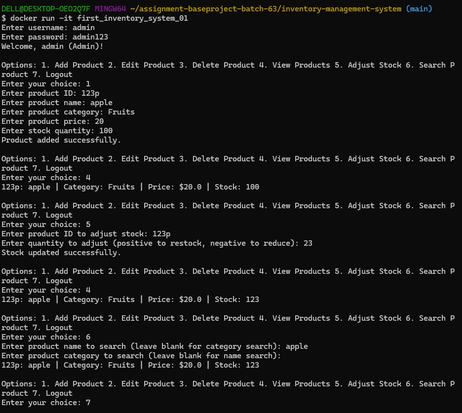

## Final Project: Inventory Management System (IMS)

### Project Title:

**Inventory Management System (IMS)**

### Objective:

Build a console-based system that manages inventory for a small business. The system should allow admins to create, update, view, and delete products in the inventory while keeping track of stock levels and handling multiple users with role-based permissions.

### Requirements & Functionalities:

- **OOP principles**: Implement classes, encapsulation, and methods for CRUD operations.
- **Data Structures**: Use dictionaries and lists for data storage and manipulation.
- **Logic Building**: Develop functions for role-based access, transaction handling, and inventory management.
- **Error Handling**: Practice exception handling for robust code.

## Running the Inventory Managment System

